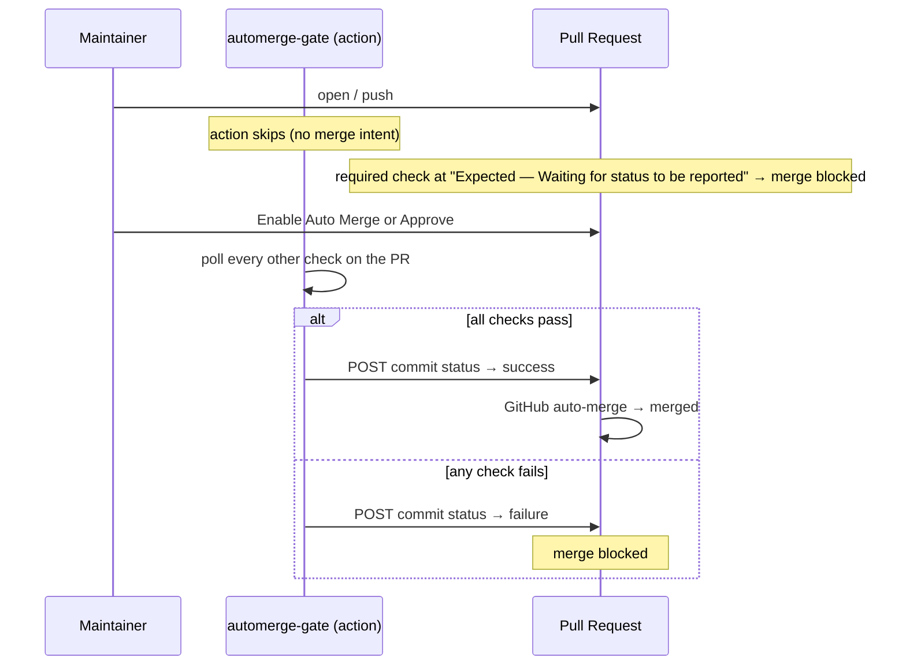
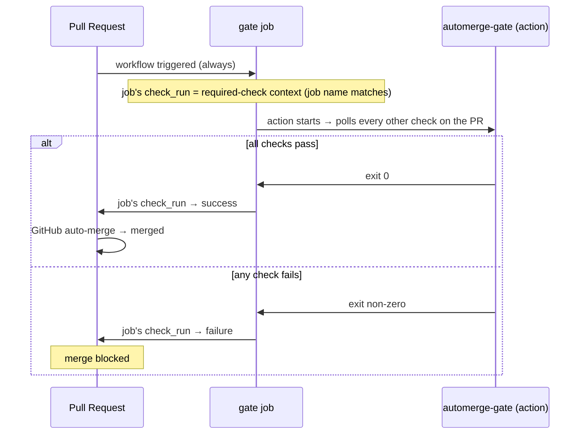

# automerge-gate

A single required check that gates **Enable Auto Merge** on every CI run that lands on a PR.

## Why

GitHub's branch protection / rulesets ask you to list each required status check by name. That list is fragile:

- Renovate / Dependabot bring in checks from external GitHub Apps that come and go.
- Monorepos use path filters, so a workflow may be skipped on some PRs and present on others.
- Adding a new workflow file means rewriting the ruleset.

automerge-gate replaces that list with **one aggregated check**. You register only that single check (`automerge-gate/all-passed`) as the required check in your ruleset. When a maintainer clicks Enable Auto Merge, the action waits for every check on the PR — across workflow files, across GitHub Apps — then reports the verdict (in private mode, as a commit status on the head SHA; in public mode, via the gate job's exit code). GitHub's native auto-merge takes the PR from there.

- Related: [Is it possible to require all GitHub Actions tasks to pass without enumerating them? · community · Discussion #26733](https://github.com/orgs/community/discussions/26733)

## How it works

automerge-gate ships in two modes, with different gate-signal mechanics. Pick the one that matches your repository's fork-PR posture (see [Usage](#usage) for the trade-offs).

### Private mode

Cost-optimized: PRs without merge intent skip polling so runner minutes are saved. The action writes the aggregated verdict as a commit status via the legacy Commit Status API.



1. A PR is opened. There's no merge intent yet, so the action skips without writing a status. The required check stays at GitHub's default `Expected — Waiting for status to be reported`, which keeps the PR blocked.
2. The maintainer clicks **Enable Auto Merge**, _or_ a reviewer with write access submits an **Approve** review. The action enters polling mode and watches every other check on the PR.
3. The action polls every other check on the PR, applying any `ignore-checks` filters.
4. After polling, the action writes the aggregated verdict (`state: success` or `failure`) as a commit status on the head SHA, keyed by the configured `context`. GitHub's required-check evaluation looks up the same `(SHA, context)` pair, so the verdict turns the required check green or red immediately.
5. GitHub's native auto-merge fires when the required check turns green.

If Auto Merge is already enabled when you push a new commit, the gate re-evaluates the new SHA automatically — no need to disable→enable. Commit status is keyed by `(SHA, context)`, so there's no per-SHA cleanup: each push targets a fresh SHA whose status starts blank until the gate posts a verdict.

If your team uses an Approve review to mean "looks good" rather than "ready to merge", remove `pull_request_review` from the workflow's `on:` triggers. The gate then only enters polling mode when Auto Merge is explicitly enabled.

### Public mode

Fork-aware: `GITHUB_TOKEN` is read-only on fork PRs, so the gate signal is the gate **job's** own auto-created check_run conclusion. The job runs on every triggering event and always polls; there is no skip path.



1. The PR is opened (or pushed to). The workflow always triggers. GitHub Actions auto-creates a check_run named after the gate job (e.g. `automerge-gate/all-passed`) — that check_run is the required-check signal.
2. The action polls every other check on the PR, applying any `ignore-checks` filters.
3. After polling, the action exits 0 (success) or non-zero (failure). The job's check_run conclusion follows the exit code, and GitHub treats it as the required check's verdict.
4. GitHub's native auto-merge fires when the required check turns green.

The action does not write its own check_run in this mode (the JOB's auto-created one is the gate). Read-only `checks: read` permission is sufficient; add `actions: read` if `ignore-checks` uses a `workflow` rule (the action resolves run-to-workflow paths via the Actions API).

Note: GitHub rulesets only support AND across required checks (no OR / conditional logic), so this action is the place where "all of these checks across workflows must pass" is expressed as a single check.

## Usage

Setup is five steps: pick a mode, add the workflow file, register the required check in the ruleset, allow auto-merge in repository settings, then click Enable Auto Merge on a PR. Run them in order — Step 5 won't show the button until Step 4 is done, and the required check from Step 3 only gates merges once a workflow run reports it.

### Step 1: Pick a mode

Choose based on whether your repository accepts external fork PRs.

- Private mode (cost-optimized) — internal-only repos that do not receive external fork PRs. The action writes the aggregated verdict as a commit status via the legacy Commit Status API. PRs without merge intent skip polling entirely so runner minutes are saved.
- Public mode (fork-aware) — repos that accept fork PRs. `GITHUB_TOKEN` is read-only on fork PRs, so the gate signal is the gate job's own check_run conclusion. The job runs on every triggering event and always polls.

|                               | private                            | public                 |
| ----------------------------- | ---------------------------------- | ---------------------- |
| `pull_request_review` trigger | yes                                | no                     |
| Job `name:`                   | (default)                          | matches required check |
| Permissions                   | `statuses: write` + `checks: read` (+ `actions: read` for `workflow` rules) | `checks: read` (+ `actions: read` for `workflow` rules) |
| API write of aggregate        | yes (commit status)                | no (job exit code)     |
| Skip on no merge intent       | yes (saves runner minutes)         | no (always polls)      |

### Step 2: Add the workflow file

Create `.github/workflows/automerge-gate.yaml` using the YAML for the mode picked in Step 1.

#### Private mode

```yaml
name: automerge-gate

on:
  pull_request:
    types: [opened, synchronize, reopened, auto_merge_enabled]
  pull_request_review:
    types: [submitted]

concurrency:
  group: ${{ github.workflow }}-${{ github.ref }}
  cancel-in-progress: true

jobs:
  gate:
    if: >-
      github.event_name != 'pull_request_review' ||
      github.event.review.state == 'approved'
    runs-on: ubuntu-latest
    timeout-minutes: 10
    permissions:
      statuses: write
      checks: read
      pull-requests: read
      actions: read
    steps:
      - uses: pkgdeps/automerge-gate@v4.1.0
        with:
          gate-mode: 'private'
          context: 'automerge-gate/all-passed'
```

The `pull_request_review.state == 'approved'` clause filters out non-Approve review submissions (`commented`, `changes_requested`) at the job level, so the runner doesn't even spin up for those. GitHub's `on:` block can filter activity types but not review state, so the filter has to live in the job's `if:`.

When a `synchronize`, `opened`, or `reopened` event fires without an active merge intent (no Auto Merge enabled, no sticky write-permission Approve), the action exits cleanly without writing a status. The required check stays at GitHub's `Expected` state and merge stays blocked, but no polling burns runner minutes.

#### Public mode

```yaml
name: automerge-gate

on:
  pull_request:
    types: [opened, synchronize, reopened, auto_merge_enabled]

concurrency:
  group: ${{ github.workflow }}-${{ github.ref }}
  cancel-in-progress: true

jobs:
  gate:
    name: automerge-gate/all-passed # must match the required check in your ruleset
    runs-on: ubuntu-latest
    timeout-minutes: 10
    permissions:
      checks: read
      pull-requests: read
      actions: read
    steps:
      - uses: pkgdeps/automerge-gate@v4.1.0
        with:
          gate-mode: 'public'
```

In public mode, the job's `name:` _is_ the required-check context — GitHub Actions creates a check_run with that name when the job starts, and its conclusion is what the required check evaluates. The action polls every triggering event (no skip path) because the read-only token can't write a "waiting" signal anyway, and a skipped job would let an unfinished PR slip through merge.

### Step 3: Register the required check

Open Settings → Rules → Rulesets (or Branches → Branch protection) and add a rule that requires the check `automerge-gate/all-passed`.

> [!WARNING]
> The autocomplete only lists checks that have already run on this repo, so the dropdown is empty on first setup. Type `automerge-gate/all-passed` by hand — both rulesets and branch protection accept any name. Once the gate runs on a PR, it shows up in the dropdown.

This single required check is now the only thing standing between a PR and merge. Any check that lands on the PR — Renovate, Codecov, your own workflows — gets aggregated into it.

### Step 4: Allow auto-merge

Open Settings → General → Pull Requests and tick **Allow auto-merge**. Without this the _Enable Auto Merge_ button doesn't show up on PRs, so Step 5 has nothing to click.

### Step 5: Enable Auto Merge on a PR

1. Get the PR ready (review, fix, etc.).
2. Click **Enable Auto Merge**.
3. The gate job runs, polls every check on the PR, then exits with `success` (or fails the job on aggregated failure).
4. On success, GitHub's native auto-merge fires immediately and merges the PR. On failure, auto-merge is blocked; fix and push again — as long as Auto Merge stays enabled, the gate re-evaluates the new SHA on every push.

> [!IMPORTANT]
> The action does **not** expose a timeout input. The job-level `timeout-minutes` is the only bound on how long the polling loop runs, and you should treat it as part of the action's configuration. There are no two timeouts to keep in sync — just one. If your CI runs longer than 10 minutes, raise `timeout-minutes` accordingly.

## Inputs

| name                    | required | default                     | description                                                                                                                                                                                                                                                                                                          |
| ----------------------- | -------- | --------------------------- | -------------------------------------------------------------------------------------------------------------------------------------------------------------------------------------------------------------------------------------------------------------------------------------------------------------------- |
| `gate-mode`             | **yes**  | (none)                      | `private` / `public`. `private` = action writes the aggregated commit status via the legacy Commit Status API (token needs `statuses: write` + `checks: read`). `public` = gate signal is the JOB's own check_run conclusion; the job's `name:` must match the required-check context (token can be `checks: read`). Either mode additionally needs `actions: read` when `ignore-checks` contains a `workflow` rule. |
| `context`               | no       | `automerge-gate/all-passed` | Aggregated commit status context. **`gate-mode: private` only** — must match the required check in your ruleset. Ignored when `gate-mode: public` (the job name is the signal).                                                                                                                                      |
| `poll-interval-seconds` | no       | `30`                        | How often to re-fetch check status                                                                                                                                                                                                                                                                                   |
| `ignore-checks`         | no       | `[]`                        | JSONC array of rules to exclude check_runs from aggregation. Each rule is `{ app?, workflow?, name? }`; fields are AND-evaluated and every field is a glob (`*` / `?`). See [Examples](#examples).                                                                                                                   |
| `token`                 | no       | `${{ github.token }}`       | GitHub token used to read checks and (when permitted) write the aggregated commit status                                                                                                                                                                                                                             |

There is **no `timeout-seconds` input on purpose** — timeout is delegated entirely to the job's `timeout-minutes` so there's a single source of truth. See the IMPORTANT note in the Usage section above.

### Examples

#### `ignore-checks`

`ignore-checks` is a JSONC array of rules. Each rule is an object with optional fields:

| field      | matches against                             | notes                                                                                                                                                                                       |
| ---------- | ------------------------------------------- | ------------------------------------------------------------------------------------------------------------------------------------------------------------------------------------------- |
| `app`      | The originating GitHub App's slug           | Internally the action reads the slug from the check_run's parent check_suite. See [Discovering what to ignore](#discovering-what-to-ignore) below for the inspection command.               |
| `workflow` | Basename of the workflow file               | GitHub Actions only; third-party Checks (no workflow file) never match a rule with `workflow` set. **Requires the workflow's token to have `actions: read` permission** — the action resolves each run's workflow path via the Actions API, and without that scope the lookup returns `null` so the rule never matches. |
| `name`     | `check_run.name`                            | This is `jobs.<key>.name` (or `jobs.<key>` if `name:` is omitted), **not** the `<workflow> / <job>` string the UI shows.                                                                    |

Within a single rule, all present fields must match (AND); absent fields are wildcards. Every field is a glob — `*` matches any run of characters, `?` matches one character. Across rules, the action excludes a check_run if **any** rule matches.

JSONC means standard JSON plus `//` / `/* */` comments and trailing commas — so this is legal:

```yaml
with:
  ignore-checks: |
    [
      { "app": "dependabot" },                                  // ignore everything from dependabot
      { "app": "renovate" },
      { "name": "optional-*" },                                 // glob across all workflows / apps
      { "app": "xcode-cloud", "name": "Build *" },              // only xcode-cloud's build jobs
      { "workflow": "ci-go.yaml", "name": "lint" },             // only ci-go.yaml's lint job (GitHub Actions)
    ]
```

#### Discovering what to ignore

The schema is shaped to mirror `gh api ... | jq` output, so you can inspect a PR's checks and paste the rows you want to ignore directly into `ignore-checks`.

```bash
gh api --paginate --slurp "repos/{owner}/{repo}/commits/{sha}/check-runs" \
  | jq '[.[].check_runs[] | { app: .app.slug, name } | with_entries(select(.value != null))]'
```

`--slurp` cannot be combined with `gh`'s built-in `--jq`, so the pipe to an external `jq` is intentional. `--slurp` collects all paginated pages into one array; the `jq` expression then flattens `.check_runs[]` across pages so the result is a single rule list rather than one array per page.

This emits one `{ app, name }` row per check_run. Pick the rows you want to silence and paste them into `ignore-checks` as-is — each row is already a valid rule:

```yaml
with:
  ignore-checks: |
    [
      { "app": "github-actions", "name": "optional-flaky" },
      { "app": "xcode-cloud", "name": "Build (release)" }
    ]
```

When the same `name` repeats across rows, those are separate check_runs from different workflows whose job names happen to collide — a common monorepo pattern:

```json
[
  { "app": "github-actions", "name": "check" },
  { "app": "github-actions", "name": "check" },
  { "app": "github-actions", "name": "gate" },
  { "app": "github-actions", "name": "check" }
]
```

To ignore one of them but not the others, add a `workflow` field to disambiguate. The `workflow` field is not in the inspection command above, but you can join in the workflow path via `check_suite_id` with a second `gh api` call against `/actions/runs?head_sha={sha}`:

```bash
SHA=...
runs=$(gh api --paginate --slurp "repos/{owner}/{repo}/actions/runs?head_sha=$SHA" \
  | jq 'map(.workflow_runs[]) | map({ (.check_suite_id|tostring): (.path | split("/") | last) }) | add')

gh api --paginate --slurp "repos/{owner}/{repo}/commits/$SHA/check-runs" \
  | jq --argjson runs "$runs" '[
      .[].check_runs[]
      | { app: .app.slug, workflow: $runs[.check_suite.id|tostring], name }
      | with_entries(select(.value != null))
    ]'
```

`workflow` is `null` (and therefore dropped from the row) for third-party Checks that don't originate from a GitHub Actions workflow. The second call requires the same `actions: read` token scope that the action itself uses for `workflow` rules. Paste the disambiguating row into `ignore-checks`:

```yaml
with:
  ignore-checks: |
    [
      { "app": "github-actions", "workflow": "ci-go.yaml", "name": "check" }
    ]
```

The command covers **check_runs only** — the data source `ignore-checks` filters against. It does not include legacy commit statuses (`/commits/{sha}/status`) or PR reviews (`/pulls/{n}/reviews`). automerge-gate likewise reads only check_runs (plus, in `gate-mode: private`, PR reviews for the approval signal); legacy commit statuses are not evaluated. Signals such as Copilot Code Review surface as PR reviews and never appear in `/check-runs`.

#### Tune polling interval for fast CI

```yaml
- uses: pkgdeps/automerge-gate@v4.1.0
  with:
    gate-mode: 'private'
    poll-interval-seconds: '10'
```

## Outputs

| name                | description                                    |
| ------------------- | ---------------------------------------------- |
| `state`             | `success` / `failure` / `skipped`              |
| `total-checks`      | Number of check_runs observed before filtering |
| `evaluated-checks`  | Number of check_runs after filters             |
| `completed-checks`  | Number of completed check_runs after filters   |
| `polled-iterations` | Number of polling iterations performed         |

## Limitations

- **Merge queue (`merge_group`)** is not supported.
- **Dead runner / job timeout**: the polling job can be killed before it finishes (its `timeout-minutes` fires, the runner dies, and so on). The gate job's check_run then ends as `failure` or `cancelled`. The required check stays red and merge stays blocked. To retry, disable Auto Merge and enable it again.
- **CIs that only write legacy commit statuses**: GitHub has two CI reporting APIs. Modern CIs (GitHub Actions, Cloudflare Pages, Codecov) use the check_run / check_suite API. Some older or self-hosted CIs (Atlantis, some Jenkins setups) only use the legacy commit-status API. This action only reads the check_run / check_suite side, so a CI that only writes legacy commit statuses is not aggregated. If you depend on such a CI, add it as a separate required check in your ruleset alongside `automerge-gate/all-passed`.

## Versioning

Releases are published as **immutable semver tags** (`v1.0.0`, `v1.1.0`, ...). There is intentionally no moving major tag (`v4`) — pin a fixed version in your workflow and let Renovate / Dependabot open PRs when a new version ships. This eliminates the supply-chain risk of a moving tag being silently rewritten.

## License

MIT
