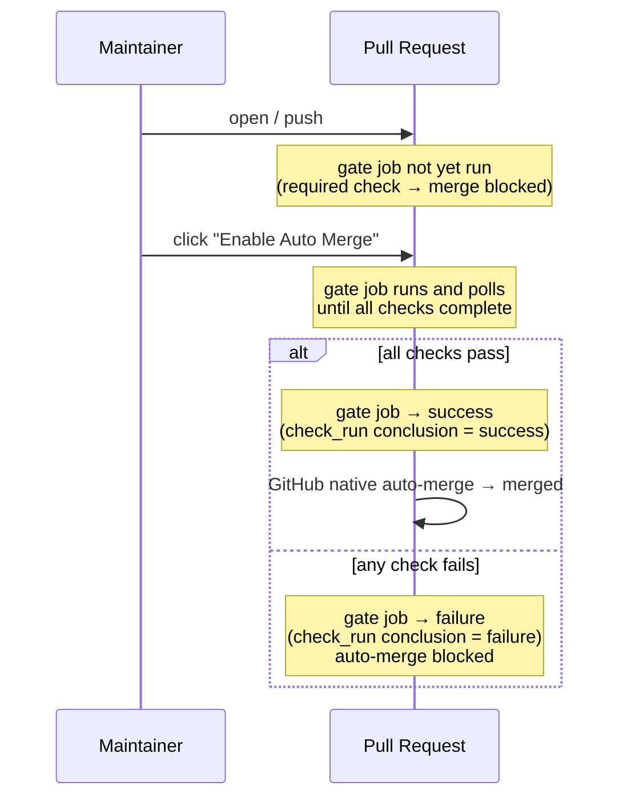
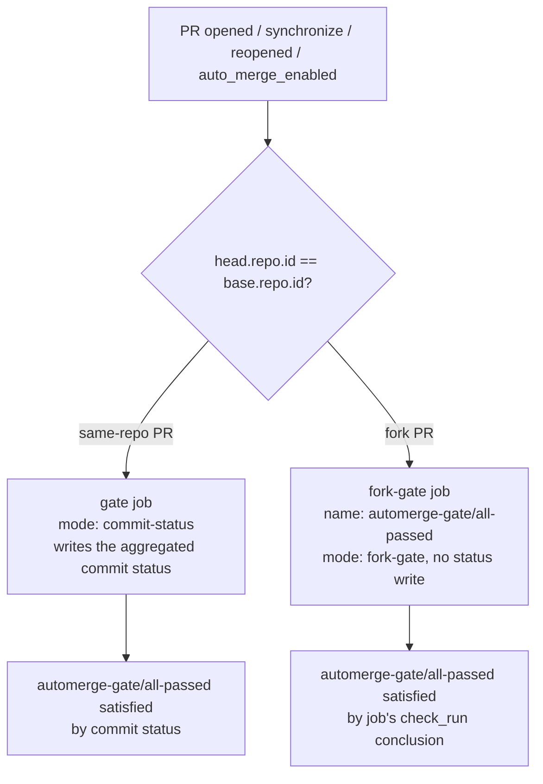

# automerge-gate

A single required check that gates **Enable Auto Merge** on every CI run that lands on a PR.

## Why

GitHub's branch protection / rulesets ask you to list each required status check by name. That list is fragile:

- Renovate / Dependabot bring in checks from external GitHub Apps that come and go.
- Monorepos use path filters, so a workflow may be skipped on some PRs and present on others.
- Adding a new workflow file means rewriting the ruleset.

automerge-gate replaces that list with **one aggregated check**. You register only that single check (`automerge-gate/all-passed`) as the required check in your ruleset. When a maintainer clicks Enable Auto Merge, the action waits for every check on the PR — across workflow files, across GitHub Apps — then exits with success or failure. The gate job's check_run conclusion is what GitHub's required-check evaluates, and GitHub's native auto-merge takes the PR from there.

## How it works



1. The PR is merge-blocked from the moment it's opened — the gate job hasn't produced a `success` conclusion for the required check yet.
2. When the maintainer clicks **Enable Auto Merge**, the gate job starts watching every other check on the PR.
3. The action exits the job with success (all checks green) or failure (any check red). The job's `check_run` conclusion — named `automerge-gate/all-passed` to match the required-check context — is what GitHub's required-check evaluates.
4. GitHub's native auto-merge takes care of the actual merge once the required check is green.

**If Auto Merge is already enabled when you push a new commit**: the action treats the synchronize event the same as `auto_merge_enabled` — it polls until all checks complete, then exits with the verdict. So you don't need to disable→enable Auto Merge after every push to retrigger the gate.

As a courtesy, the `gate` job (commit-status mode) writes an aggregated commit status (`automerge-gate/all-passed`) so the status appears next to other commit statuses in the PR UI. Fork PRs are handled by the separate `fork-gate` job (fork-gate mode) where the job's check_run name itself satisfies the required check.

### Fork PRs

GitHub forces `GITHUB_TOKEN` read-only on fork PRs, so a status-write-based gate cannot run there. The recommended workflow uses a 2-job pattern with an `if:` mutex on `head.repo.id == base.repo.id`, so exactly one job runs per PR:



The `fork-gate` job sets `name: automerge-gate/all-passed` so GitHub names its check_run after the job. The required check is satisfied directly by the fork-gate job's conclusion — no token write needed. The action runs in `mode: fork-gate` and never attempts a status write. Skipped jobs (the inactive branch of the mutex) do not block the required check.

Note: GitHub rulesets only support AND across required checks (no OR / conditional logic), so this action is the place where "all of these checks across workflows must pass" is expressed as a single check.

## Usage

### 1. Add the workflow

Create `.github/workflows/automerge-gate.yaml` in your repository. The workflow uses a 2-job pattern with an `if:` mutex so exactly one of `gate` / `fork-gate` runs per PR:

```yaml
name: automerge-gate

on:
  pull_request:
    types: [opened, synchronize, reopened, auto_merge_enabled]

concurrency:
  group: automerge-gate-${{ github.event.pull_request.number }}
  cancel-in-progress: true

jobs:
  gate:
    # Same-repo PR: the token has `statuses: write`, so the action writes
    # the aggregated commit status (`automerge-gate/all-passed`) directly.
    if: github.event.pull_request.head.repo.id == github.event.pull_request.base.repo.id
    runs-on: ubuntu-latest
    # `timeout-minutes` is effectively the action's timeout. The action has
    # no internal timeout input — the polling loop runs until all checks
    # complete or the runner is killed by this value.
    timeout-minutes: 10
    permissions:
      statuses: write     # write the aggregated commit status
      checks: read        # listSuitesForRef / listForSuite
      pull-requests: read
      actions: read       # resolve own workflow path for self-exclusion
    steps:
      - uses: pkgdeps/automerge-gate@v2.0.0
        with:
          context: 'automerge-gate/all-passed'   # must match the required check in your ruleset

  fork-gate:
    # Fork PR: GitHub forces GITHUB_TOKEN read-only, so a status write is
    # impossible. Instead, set `name:` to the required-check context — the
    # job's check_run takes that name and its conclusion is what the required
    # check evaluates. The action runs in fork-gate mode and never attempts
    # a status write — `statuses: write` is intentionally NOT requested here.
    if: github.event.pull_request.head.repo.id != github.event.pull_request.base.repo.id
    name: automerge-gate/all-passed
    runs-on: ubuntu-latest
    timeout-minutes: 10
    permissions:
      checks: read        # listSuitesForRef / listForSuite
      pull-requests: read
      actions: read       # resolve own workflow path for self-exclusion
    steps:
      - uses: pkgdeps/automerge-gate@v2.0.0
        with:
          mode: fork-gate
```

Why two jobs:

- The `if:` condition `head.repo.id == base.repo.id` is a mutex — exactly one of `gate` / `fork-gate` runs per PR. The other is skipped, and skipped jobs do not block required checks.
- The `gate` job (commit-status mode) writes the aggregated status. Same-repo PRs have a full-permission `GITHUB_TOKEN`, so the write succeeds.
- The `fork-gate` job (fork-gate mode) has its `name:` set to `automerge-gate/all-passed`. GitHub names the check_run after the job, so the required check is satisfied by the job's check_run conclusion directly — no token write needed.
- Putting both in a single job with the same name as the status would produce duplicate entries in the PR UI (`status` + `check_run`), which makes the required-check evaluation ambiguous. Splitting on `if:` keeps each PR with exactly one signal of the right kind.

`ignore-apps` / `ignore-checks` などの optional inputs は [Inputs](#inputs) を参照してください。

### 2. Register the required check + allow auto-merge

In repository **Settings**:

- **Rules → Rulesets** (or **Branches → Branch protection**): add a rule that requires the check `automerge-gate/all-passed`. Type the context name directly — rulesets accept it without needing it to be seeded first.
- **General → Pull Requests**: tick **Allow auto-merge**. Without this the *Enable Auto Merge* button doesn't show up on PRs.

This single required check is now the only thing standing between a PR and merge. Any check that lands on the PR — Renovate, Codecov, your own workflows — gets aggregated into it.

### 3. Press Enable Auto Merge

On any PR you want to ship:

1. Get the PR ready (review, fix, etc.).
2. Click **Enable Auto Merge**.
3. The gate job runs, polls every check on the PR, then exits with `success` (or fails the job on aggregated failure).
4. On success, GitHub's native auto-merge fires immediately and merges the PR. On failure, auto-merge is blocked; fix and push again — as long as Auto Merge stays enabled, the gate re-evaluates the new SHA on every push.

> [!IMPORTANT]
> The action does **not** expose a timeout input. The job-level `timeout-minutes` is the only bound on how long the polling loop runs, and you should treat it as part of the action's configuration. There are no two timeouts to keep in sync — just one. If your CI runs longer than 10 minutes, raise `timeout-minutes` accordingly.

## Inputs

| name | required | default | description |
|---|---|---|---|
| `context` | no | `automerge-gate/all-passed` | Commit status context name. Must match the required check in your ruleset. |
| `poll-interval-seconds` | no | `30` | How often to re-fetch check status |
| `ignore-apps` | no | (empty) | GitHub App slugs to exclude. Comma-separated **or newline-separated** |
| `ignore-checks` | no | (empty) | check_run name patterns to exclude (glob `*` / `?`). Comma-separated **or newline-separated** |
| `mode` | no | `commit-status` | `commit-status` / `fork-gate`. `commit-status` writes the aggregated commit status. `fork-gate` skips the status write entirely so the gate is the job's check_run conclusion (used by the fork-gate job whose `name:` matches the required check). |
| `token` | no | `${{ github.token }}` | GitHub token used to read checks and (when permitted) write commit status |

There is **no `timeout-seconds` input on purpose** — timeout is delegated entirely to the job's `timeout-minutes` so there's a single source of truth. See the IMPORTANT note in the Usage section above.

### Examples

**Exclude specific GitHub Apps from aggregation:**

```yaml
      - uses: pkgdeps/automerge-gate@v2.0.0
        with:
          ignore-apps: |
            dependabot
            renovate
```

**Exclude check_runs by glob (matches across path separators like `ci / lint`):**

```yaml
      - uses: pkgdeps/automerge-gate@v2.0.0
        with:
          ignore-checks: |
            optional-*
            docs-only
            ci / lint
```

`ignore-apps` / `ignore-checks` accept either comma-separated values (`a,b,c`) or one entry per line via the YAML `|` block scalar.

**Tune polling interval for fast CI:**

```yaml
      - uses: pkgdeps/automerge-gate@v2.0.0
        with:
          poll-interval-seconds: '10'
```

**`mode: fork-gate` (fork-gate job):**

```yaml
  fork-gate:
    if: github.event.pull_request.head.repo.id != github.event.pull_request.base.repo.id
    name: automerge-gate/all-passed
    runs-on: ubuntu-latest
    timeout-minutes: 10
    steps:
      - uses: pkgdeps/automerge-gate@v2.0.0
        with:
          mode: fork-gate
```

In `fork` mode the action never writes a commit status; the gate is the job's own check_run conclusion, which is named after the job (`automerge-gate/all-passed` here) and matches the required check in your ruleset.

## Outputs

| name | description |
|---|---|
| `state` | `pending` / `success` / `failure` |
| `total-checks` | Number of check_runs observed before filtering |
| `evaluated-checks` | Number of check_runs after filters |
| `completed-checks` | Number of completed check_runs after filters |
| `polled-iterations` | Number of polling iterations (0 in pending mode) |

## Why this design

- **`pull_request.auto_merge_enabled` has no recursion guard** unlike `check_suite.completed`, so the gate reliably fires on GitHub-Actions-only repos.
- **Polling is gated by an explicit signal** (Enable Auto Merge), so PRs the maintainer hasn't yet decided to merge don't burn runner minutes. Compared with merge-gatekeeper, which polls on every PR push, the resource cost scales with merge intent rather than with PR throughput.
- **Gating is the gate job's check_run conclusion, not a commit status.** GitHub forces `GITHUB_TOKEN` read-only on fork PRs, so a status-write-based gate can't run there at all. By gating on the job's exit code (the check_run conclusion), the action works uniformly for same-repo and fork PRs. The aggregated commit status is still written as a courtesy when the token has write permission — the dual signal is convenient when both are visible.
- **The aggregated check_run is the gate job's own conclusion** (named `automerge-gate/all-passed` to match the required check). There's no self-referencing loop in the github-actions check_suite — the gate doesn't see its own writes when it polls because it filters out check_runs from its own workflow.
- **GitHub native auto-merge handles the merge itself** once the required check turns green. This Action does not call `pulls.merge`.
- **No internal timeout input** — timeout is managed by the job's `timeout-minutes`. Having two timeouts to keep in sync (action input vs job-level) is a footgun, so the action delegates fully. There's exactly one knob, and it's a standard GitHub Actions feature.

## Limitations

- **Merge queue (`merge_group`)** is not supported.
- **Dead runner / job timeout**: if the runner is killed mid-polling (job hits `timeout-minutes`, dies physically, etc.), the gate job's check_run becomes `failure` (or `cancelled`), so the required check stays red and merge stays blocked. The maintainer can disable then re-enable Auto Merge to re-trigger.
- **Legacy commit status events**: third-party CI that writes via the legacy commit status API may not appear in `check_suite` and would not be aggregated. The action does not handle the `status` event.
- **Stale `pending` on past commits**: when the courtesy commit-status write succeeds, each push to a PR appends a `pending` status to the new HEAD SHA. GitHub's commit status API is append-only — past SHAs keep that `pending` in their history forever (no API to delete or overwrite). This has no effect on the PR's HEAD evaluation or on auto-merge (both look only at the latest SHA), but the per-commit hover in the PR's Commits tab will show `pending` for older SHAs.

## Versioning

Releases are published as **immutable semver tags** (`v1.0.0`, `v1.1.0`, ...). There is intentionally no moving major tag (`v1`) — pin a fixed version in your workflow and let Renovate / Dependabot open PRs when a new version ships. This eliminates the supply-chain risk of a moving tag being silently rewritten.

## Releasing (maintainers)

All releases are cut from the GitHub web UI. There is no release script and no `npm publish` step.

### Pre-release checklist

1. `main` is green on CI.
2. `dist/index.js` is in sync with `src/`. The pre-commit hook keeps it in sync; if in doubt run:
   ```bash
   npm run build
   git diff --exit-code dist/   # should be empty
   ```

### Cutting a release

1. Go to **Releases → Draft a new release**.
2. **Choose a tag**: type the new version (e.g. `v1.0.0`) and select *Create new tag on publish*.
3. **Target**: `main`.
4. **Release title**: same as the tag (e.g. `v1.0.0`).
5. Click **Generate release notes** to autopopulate from PRs / commits since the last tag.
6. **Set as the latest release**: ✅
7. **Mark as an immutable release** (Public Preview): ✅ if the option is shown — locks the tag and asset checksums so they cannot be silently rewritten later.
8. **Publish to GitHub Marketplace**: ✅ on the **first** release only. Subsequent releases auto-update the existing Marketplace listing.
9. Click **Publish release**.

### After publishing

Users pin a fixed version: `uses: pkgdeps/automerge-gate@v2.0.0`. Renovate / Dependabot will open update PRs as new versions ship.

## License

MIT
