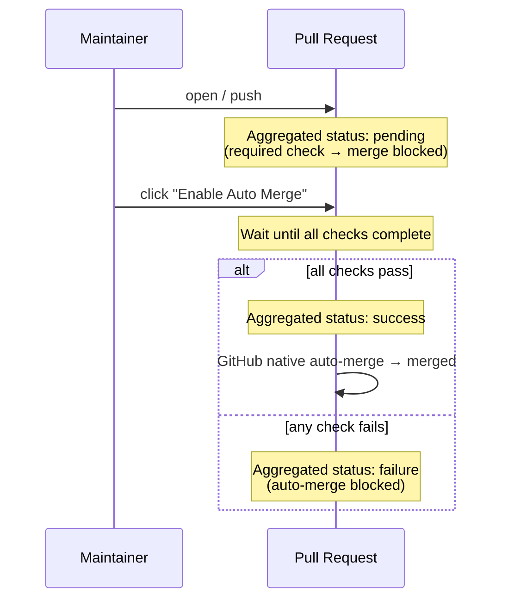
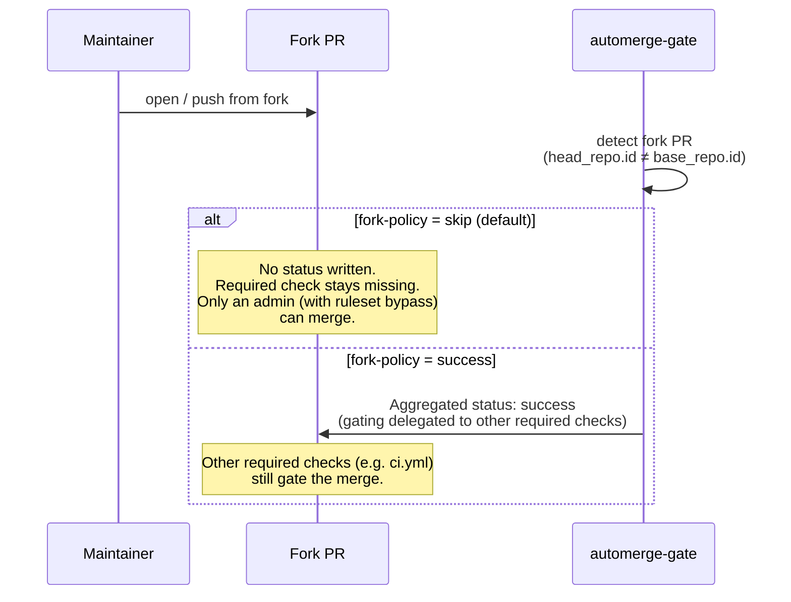

# automerge-gate

A single required status check that gates **Enable Auto Merge** on every CI run that lands on a PR.

## Why

GitHub's branch protection / rulesets ask you to list each required status check by name. That list is fragile:

- Renovate / Dependabot bring in checks from external GitHub Apps that come and go.
- Monorepos use path filters, so a workflow may be skipped on some PRs and present on others.
- Adding a new workflow file means rewriting the ruleset.

automerge-gate replaces that list with **one aggregated commit status**. You register only that single status as a required check. When a maintainer clicks Enable Auto Merge, the action waits for every check on the PR — across workflow files, across GitHub Apps — then flips its status to green once they all pass. GitHub's native auto-merge takes the PR from there.

## How it works



1. The PR is merge-blocked from the moment it's opened — the aggregated status is `pending` with `Awaiting Auto Merge enable`.
2. When the maintainer clicks **Enable Auto Merge**, the gate starts watching every check on the PR.
3. The gate flips the aggregated status to `success` (all checks green) or `failure` (any check red).
4. GitHub's native auto-merge takes care of the actual merge once everything is green.

**If Auto Merge is already enabled when you push a new commit**: the action treats the synchronize event the same as `auto_merge_enabled` — it polls until all checks complete, then writes the aggregated status. So you don't need to disable→enable Auto Merge after every push to retrigger the gate.

### Fork PRs

GitHub issues a read-only `GITHUB_TOKEN` for fork PRs by default, so writing a commit status would fail. The action detects fork PRs (by comparing head and base repository IDs) and behaves according to the `fork-policy` input:



- Use `skip` (default) when fork PRs are rare and you're comfortable having an admin bypass the ruleset to merge them. The required check stays missing, so non-admins can't merge.
- Use `success` for OSS-style repositories where fork PRs are common. Pair it with another required check (e.g. ci.yml) that gates the fork's commits, so this action stays out of the way for forks while real gating still happens.

Note: GitHub rulesets only support AND across required checks (no OR / conditional logic), so this action is the place where "all of these checks across workflows must pass" is expressed as a single status. The fork-policy input is the corresponding escape hatch for the case where the action itself can't run.

## Usage

### 1. Add the workflow

Create `.github/workflows/automerge-gate.yaml` in your repository:

```yaml
name: automerge-gate

on:
  pull_request:
    types: [opened, synchronize, reopened, auto_merge_enabled]

permissions:
  statuses: write
  checks: read
  pull-requests: read
  actions: read

concurrency:
  group: automerge-gate-${{ github.event.pull_request.number }}
  cancel-in-progress: true

jobs:
  gate:
    runs-on: ubuntu-latest
    # `timeout-minutes` is effectively the action's timeout. The action has
    # no internal timeout input — the polling loop runs until all checks
    # complete or the runner is killed by this value. Set it to roughly the
    # longest CI duration in your repository.
    timeout-minutes: 10
    steps:
      - uses: pkgdeps/automerge-gate@v1.0.0
        with:
          context: 'automerge-gate/all-passed'   # must match the required check in your ruleset
```

`ignore-apps` / `ignore-checks` / `fork-policy` などの optional inputs は [Inputs](#inputs) を参照してください。

### 2. Register the required check + allow auto-merge

In repository **Settings**:

- **Rules → Rulesets** (or **Branches → Branch protection**): add a rule that requires the status check `automerge-gate/all-passed`. Type the context name directly — rulesets accept it without needing it to be seeded first.
- **General → Pull Requests**: tick **Allow auto-merge**. Without this the *Enable Auto Merge* button doesn't show up on PRs.

This single required check is now the only thing standing between a PR and merge. Any check that lands on the PR — Renovate, Codecov, your own workflows — gets aggregated into it.

### 3. Press Enable Auto Merge

On any PR you want to ship:

1. Get the PR ready (review, fix, etc.).
2. Click **Enable Auto Merge**.
3. The gate flips into polling mode, waits for every check to complete, then writes `success` (or `failure`).
4. On `success`, GitHub's native auto-merge fires immediately and merges the PR. On `failure`, auto-merge is blocked; fix and push again — as long as Auto Merge stays enabled, the gate re-evaluates the new SHA on every push.

> [!IMPORTANT]
> The action does **not** expose a timeout input. The job-level `timeout-minutes` is the only bound on how long the polling loop runs, and you should treat it as part of the action's configuration. There are no two timeouts to keep in sync — just one. If your CI runs longer than 10 minutes, raise `timeout-minutes` accordingly.

## Inputs

| name | required | default | description |
|---|---|---|---|
| `context` | no | `automerge-gate/all-passed` | Commit status context name. Must match the required check in your ruleset. |
| `poll-interval-seconds` | no | `30` | How often to re-fetch check status |
| `ignore-apps` | no | (empty) | GitHub App slugs to exclude. Comma-separated **or newline-separated** |
| `ignore-checks` | no | (empty) | check_run name patterns to exclude (glob `*` / `?`). Comma-separated **or newline-separated** |
| `token` | no | `${{ github.token }}` | GitHub token |
| `fork-policy` | no | `skip` | How to handle fork PRs. `skip` writes no status (maintainer handles manually). `success` writes a success status, delegating gating to other required checks (e.g. ci.yml) |

There is **no `timeout-seconds` input on purpose** — timeout is delegated entirely to the job's `timeout-minutes` so there's a single source of truth. See the IMPORTANT note in the Usage section above.

### Examples

**Exclude specific GitHub Apps from aggregation:**

```yaml
      - uses: pkgdeps/automerge-gate@v1.0.0
        with:
          ignore-apps: |
            dependabot
            renovate
```

**Exclude check_runs by glob (matches across path separators like `ci / lint`):**

```yaml
      - uses: pkgdeps/automerge-gate@v1.0.0
        with:
          ignore-checks: |
            optional-*
            docs-only
            ci / lint
```

`ignore-apps` / `ignore-checks` accept either comma-separated values (`a,b,c`) or one entry per line via the YAML `|` block scalar.

**Tune polling interval for fast CI:**

```yaml
      - uses: pkgdeps/automerge-gate@v1.0.0
        with:
          poll-interval-seconds: '10'
```

**Allow fork PRs through (delegating gating to other required checks):**

```yaml
      - uses: pkgdeps/automerge-gate@v1.0.0
        with:
          fork-policy: success
```

Pair this with another required check (e.g. ci.yml registered separately in the ruleset) so fork PRs still get gated by something.

## Outputs

| name | description |
|---|---|
| `state` | `pending` / `success` / `failure` |
| `total-checks` | Number of check_runs observed before filtering |
| `evaluated-checks` | Number of check_runs after filters |
| `completed-checks` | Number of completed check_runs after filters |
| `polled-iterations` | Number of polling iterations (0 in pending mode) |

## Why this design

- **`pull_request.auto_merge_enabled` has no recursion guard** unlike `check_suite.completed`, so the gate reliably fires on GitHub-Actions-only repos.
- **Polling is gated by an explicit signal** (Enable Auto Merge), so PRs the maintainer hasn't yet decided to merge don't burn runner minutes. Compared with merge-gatekeeper, which polls on every PR push, the resource cost scales with merge intent rather than with PR throughput.
- **The aggregated result is a commit status, not a check_run**, so there's no self-referencing loop in the github-actions check_suite — the gate doesn't see its own writes when it polls.
- **GitHub native auto-merge handles the merge itself** once the aggregated status turns green. This Action does not call `pulls.merge`.
- **No internal timeout input** — timeout is managed by the job's `timeout-minutes`. Having two timeouts to keep in sync (action input vs job-level) is a footgun, so the action delegates fully. There's exactly one knob, and it's a standard GitHub Actions feature.

## Limitations

- **Fork PRs**: GitHub Actions issues a read-only `GITHUB_TOKEN` for fork PRs by default, so the action cannot write a commit status. Use the `fork-policy` input to decide what should happen: `skip` (default) leaves the required check unset (maintainer handles the PR manually), `success` writes a success status delegating gating to other required checks. To actually run the polling loop on fork PRs, you would also need to enable "Send write tokens to workflows from fork pull requests" in repository settings — this is not verified in v1.
- **Merge queue (`merge_group`)** is not supported in v1.
- **Dead runner / job timeout**: if the runner is killed mid-polling (job hits `timeout-minutes`, dies physically, etc.), the commit status remains as it was last written (`pending`). The maintainer can disable then re-enable Auto Merge to re-trigger.
- **Legacy commit status events**: third-party CI that writes via the legacy commit status API may not appear in `check_suite` and would not be aggregated. v2 does not handle the `status` event.
- **Stale `pending` on past commits**: each push to a PR writes a `pending` status to the new HEAD SHA. GitHub's commit status API is append-only — past SHAs keep that `pending` in their history forever (no API to delete or overwrite). This has no effect on the PR's HEAD evaluation or on auto-merge (both look only at the latest SHA), but the per-commit hover in the PR's Commits tab will show `pending` for older SHAs.

## v1 (archived)

The previous version of this Action under the name `check-suite-gate` is preserved in the git history of this repository. The post-mortem on why it didn't work (Japanese) is in [`docs/lessons/2026-05-05-check-suite-recursion-finding.md`](docs/lessons/2026-05-05-check-suite-recursion-finding.md). The v1 spec and plan are also kept under `docs/superpowers/specs/` and `docs/superpowers/plans/` for reference.

## Versioning

Releases are published as **immutable semver tags** (`v1.0.0`, `v1.1.0`, ...). There is intentionally no moving major tag (`v1`) — pin a fixed version in your workflow and let Renovate / Dependabot open PRs when a new version ships. This eliminates the supply-chain risk of a moving tag being silently rewritten.

## Releasing (maintainers)

All releases are cut from the GitHub web UI. There is no release script and no `npm publish` step.

### Pre-release checklist

1. `main` is green on CI.
2. `dist/index.js` is in sync with `src/`. The pre-commit hook keeps it in sync; if in doubt run:
   ```bash
   npm run build
   git diff --exit-code dist/   # should be empty
   ```

### Cutting a release

1. Go to **Releases → Draft a new release**.
2. **Choose a tag**: type the new version (e.g. `v1.0.0`) and select *Create new tag on publish*.
3. **Target**: `main`.
4. **Release title**: same as the tag (e.g. `v1.0.0`).
5. Click **Generate release notes** to autopopulate from PRs / commits since the last tag.
6. **Set as the latest release**: ✅
7. **Mark as an immutable release** (Public Preview): ✅ if the option is shown — locks the tag and asset checksums so they cannot be silently rewritten later.
8. **Publish to GitHub Marketplace**: ✅ on the **first** release only. Subsequent releases auto-update the existing Marketplace listing.
9. Click **Publish release**.

### After publishing

Users pin a fixed version: `uses: pkgdeps/automerge-gate@v1.0.0`. Renovate / Dependabot will open update PRs as new versions ship.

## License

MIT
