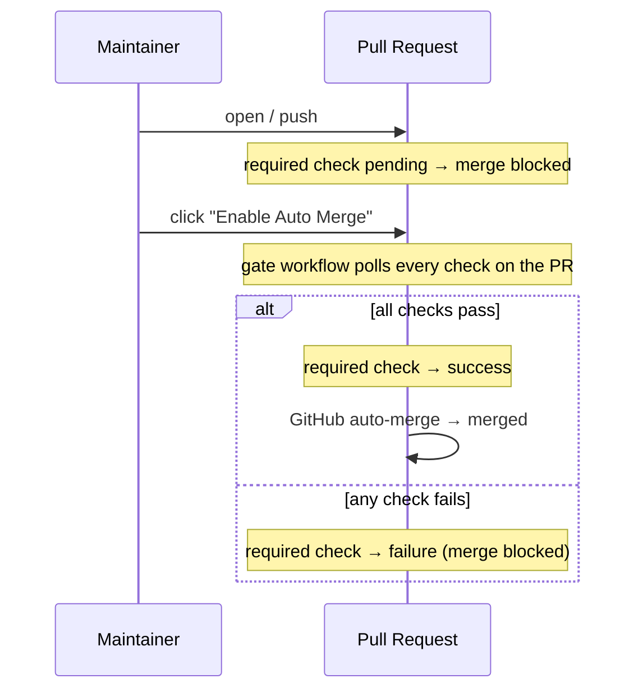

# automerge-gate

A single required check that gates **Enable Auto Merge** on every CI run that lands on a PR.

## Why

GitHub's branch protection / rulesets ask you to list each required status check by name. That list is fragile:

- Renovate / Dependabot bring in checks from external GitHub Apps that come and go.
- Monorepos use path filters, so a workflow may be skipped on some PRs and present on others.
- Adding a new workflow file means rewriting the ruleset.

automerge-gate replaces that list with **one aggregated check**. You register only that single check (`automerge-gate/all-passed`) as the required check in your ruleset. When a maintainer clicks Enable Auto Merge, the action waits for every check on the PR — across workflow files, across GitHub Apps — then exits with success or failure. The gate job's check_run conclusion is what GitHub's required-check evaluates, and GitHub's native auto-merge takes the PR from there.

## How it works



1. A PR is merge-blocked from the moment it's opened. The gate writes a check_run with `status: queued` and a "Click Enable Auto Merge to start the gate." summary.
2. When the maintainer clicks **Enable Auto Merge**, the gate workflow polls every check on the PR.
3. It updates the same check_run with the verdict (`conclusion: success` or `failure`).
4. GitHub's native auto-merge merges the PR as soon as the required check turns green.

If Auto Merge is already enabled when you push a new commit, the gate re-evaluates the new SHA automatically — no need to disable→enable.

Same-repo and fork PRs are both handled by the same workflow via a 2-job `if:` mutex; see [Usage](#usage).

Note: GitHub rulesets only support AND across required checks (no OR / conditional logic), so this action is the place where "all of these checks across workflows must pass" is expressed as a single check.

## Usage

### 1. Add the workflow

Create `.github/workflows/automerge-gate.yaml` in your repository. The workflow uses a 2-job pattern with an `if:` mutex so exactly one of `main-gate` / `fork-gate` runs per PR:

```yaml
name: automerge-gate

on:
  pull_request:
    types: [opened, synchronize, reopened, auto_merge_enabled]

concurrency:
  group: automerge-gate-${{ github.event.pull_request.number }}
  cancel-in-progress: true

jobs:
  # Same-repo PR. Token has checks:write, so the action writes the aggregated check_run directly.
  main-gate:
    if: github.event.pull_request.head.repo.id == github.event.pull_request.base.repo.id
    runs-on: ubuntu-latest
    # timeout-minutes is the action's only timeout. Bound it to your CI's worst case.
    timeout-minutes: 10
    permissions:
      checks: write
      pull-requests: read
      actions: read
    steps:
      - uses: pkgdeps/automerge-gate@v2.0.0
        with:
          mode: main-gate
          context: 'automerge-gate/all-passed'

  # Fork PR. Token is read-only, so the gate is the job's own check_run conclusion (named after the job).
  fork-gate:
    if: github.event.pull_request.head.repo.id != github.event.pull_request.base.repo.id
    name: automerge-gate/all-passed
    runs-on: ubuntu-latest
    timeout-minutes: 10
    permissions:
      checks: read
      pull-requests: read
      actions: read
    steps:
      - uses: pkgdeps/automerge-gate@v2.0.0
        with:
          mode: fork-gate
```

Why two jobs:

**Both jobs do the same polling**: each one waits for every other check on the PR to finish, then decides success or failure. They only differ in *how* they report the verdict to GitHub's required check:

- **`main-gate`** (same-repo PR): the token has `checks: write`, so the action writes the aggregated verdict as a check_run named `automerge-gate/all-passed`. While Auto Merge has not been enabled yet, the action writes that check_run with `status: queued` (a non-terminal yellow-dot state) so merge stays blocked; once polling runs, the same check_run is patched to `status: completed` with `conclusion: success` or `failure`.
- **`fork-gate`** (fork PR): the token is read-only — a check_run write would 403. The job's `name:` is set to `automerge-gate/all-passed`, so GitHub names *the job's own check_run* after it. After polling, the action exits with success or failure, and that exit code becomes the check_run conclusion — which is what the required check evaluates.

The `if:` condition `head.repo.id == base.repo.id` is a mutex: exactly one of the two runs per PR; the other is `skipped`, and skipped jobs don't block required checks. Splitting them keeps each PR with exactly one signal of the right kind — combining them into a single job whose name matches the aggregate would produce two `automerge-gate/all-passed` check_runs in the PR UI (one written by the action, one created by GitHub Actions for the job) and make the required-check evaluation ambiguous.

See [Inputs](#inputs) for optional inputs like `ignore-apps` / `ignore-checks`.

### 2. Register the required check + allow auto-merge

In repository **Settings**:

- **Rules → Rulesets** (or **Branches → Branch protection**): add a rule that requires the check `automerge-gate/all-passed`. Type the context name directly — rulesets accept it without needing it to be seeded first.
- **General → Pull Requests**: tick **Allow auto-merge**. Without this the *Enable Auto Merge* button doesn't show up on PRs.

This single required check is now the only thing standing between a PR and merge. Any check that lands on the PR — Renovate, Codecov, your own workflows — gets aggregated into it.

### 3. Press Enable Auto Merge

On any PR you want to ship:

1. Get the PR ready (review, fix, etc.).
2. Click **Enable Auto Merge**.
3. The gate job runs, polls every check on the PR, then exits with `success` (or fails the job on aggregated failure).
4. On success, GitHub's native auto-merge fires immediately and merges the PR. On failure, auto-merge is blocked; fix and push again — as long as Auto Merge stays enabled, the gate re-evaluates the new SHA on every push.

> [!IMPORTANT]
> The action does **not** expose a timeout input. The job-level `timeout-minutes` is the only bound on how long the polling loop runs, and you should treat it as part of the action's configuration. There are no two timeouts to keep in sync — just one. If your CI runs longer than 10 minutes, raise `timeout-minutes` accordingly.

## Inputs

| name | required | default | description |
|---|---|---|---|
| `context` | no | `automerge-gate/all-passed` | Aggregated check_run name. Must match the required check in your ruleset. |
| `poll-interval-seconds` | no | `30` | How often to re-fetch check status |
| `ignore-apps` | no | (empty) | GitHub App slugs to exclude. Comma-separated **or newline-separated** |
| `ignore-checks` | no | (empty) | check_run name patterns to exclude (glob `*` / `?`). Comma-separated **or newline-separated** |
| `mode` | **yes** | (none) | `main-gate` / `fork-gate`. `main-gate` writes the aggregated check_run (used by the `main-gate` job for same-repo PRs). `fork-gate` skips the check_run write entirely so the gate is the job's own check_run conclusion (used by the `fork-gate` job whose `name:` matches the required check, for fork PRs with read-only token). |
| `token` | no | `${{ github.token }}` | GitHub token used to read checks and (when permitted) write the aggregated check_run |

There is **no `timeout-seconds` input on purpose** — timeout is delegated entirely to the job's `timeout-minutes` so there's a single source of truth. See the IMPORTANT note in the Usage section above.

### Examples

`ignore-checks` matches against the GitHub API's `check_run.name`, which is `jobs.<key>.name` (or `jobs.<key>` if `name:` is omitted). It is **not** the `<workflow> / <job>` string the GitHub UI shows. Inspect the actual values with:

```bash
gh api "repos/{owner}/{repo}/commits/{sha}/check-runs" \
  --jq '.check_runs[] | {name, app: .app.slug, conclusion}'
```

**Exclude specific GitHub Apps from aggregation:**

```yaml
      - uses: pkgdeps/automerge-gate@v2.0.0
        with:
          mode: main-gate
          ignore-apps: |
            dependabot
            renovate
```

**Exclude check_runs by glob:**

```yaml
      - uses: pkgdeps/automerge-gate@v2.0.0
        with:
          mode: main-gate
          ignore-checks: |
            optional-*
            docs-only
```

`ignore-apps` / `ignore-checks` accept either comma-separated values (`a,b,c`) or one entry per line via the YAML `|` block scalar.

**Tune polling interval for fast CI:**

```yaml
      - uses: pkgdeps/automerge-gate@v2.0.0
        with:
          mode: main-gate
          poll-interval-seconds: '10'
```

## Outputs

| name | description |
|---|---|
| `state` | `pending` / `success` / `failure` |
| `total-checks` | Number of check_runs observed before filtering |
| `evaluated-checks` | Number of check_runs after filters |
| `completed-checks` | Number of completed check_runs after filters |
| `polled-iterations` | Number of polling iterations performed |

## Why this design

- **`pull_request.auto_merge_enabled` has no recursion guard** unlike `check_suite.completed`, so the gate reliably fires on GitHub-Actions-only repos.
- **Polling is gated by an explicit signal** (Enable Auto Merge), so PRs the maintainer hasn't yet decided to merge don't burn runner minutes. Compared with merge-gatekeeper, which polls on every PR push, the resource cost scales with merge intent rather than with PR throughput.
- **Gating is the gate job's check_run conclusion.** GitHub forces `GITHUB_TOKEN` read-only on fork PRs, so a write-based gate can't run there at all. By gating on the job's exit code (the check_run conclusion named `automerge-gate/all-passed` to match the required check), the action works uniformly for same-repo and fork PRs. The aggregated check_run is still written as a courtesy in `main-gate` mode when the token has `checks: write` — same name as the required check, with `status: queued` while waiting for Enable Auto Merge and `conclusion: success` / `failure` after polling. There's no self-referencing loop because the action filters out check_runs from its own workflow.
- **Check_run instead of commit status.** Commit statuses are append-only per SHA, so the same SHA's pending → success/failure transition stacks two entries; the Checks API lets the gate PATCH a single check_run by id, keeping the PR UI to one row per SHA. It also unlocks `conclusion: stale` for future cleanup of old SHAs.
- **GitHub native auto-merge handles the merge itself** once the required check turns green. This Action does not call `pulls.merge`.
- **No internal timeout input** — timeout is managed by the job's `timeout-minutes`. Having two timeouts to keep in sync (action input vs job-level) is a footgun, so the action delegates fully. There's exactly one knob, and it's a standard GitHub Actions feature.

## Limitations

- **Merge queue (`merge_group`)** is not supported.
- **Dead runner / job timeout**: if the runner is killed mid-polling (job hits `timeout-minutes`, dies physically, etc.), the gate job's check_run becomes `failure` (or `cancelled`), so the required check stays red and merge stays blocked. The maintainer can disable then re-enable Auto Merge to re-trigger.
- **CIs that only write legacy commit statuses**: GitHub has two ways for CIs to report results — the modern check_run / check_suite API (used by GitHub Actions, Cloudflare Pages, Codecov, etc.) and the legacy commit-status API (used by some older or self-hosted CIs like Atlantis or some Jenkins setups). The action polls the check_run / check_suite side, so a CI that only writes legacy commit statuses isn't aggregated. If you depend on such a CI, register it as a separate required check in your ruleset alongside `automerge-gate/all-passed`.
- **Force-push edge case (`main-gate` only)**: every push to a PR creates an aggregated check_run on the new HEAD SHA, and `pull_request.synchronize` events also mark the previous SHA's check_run with `conclusion: cancelled` (using the payload's `before` SHA — `conclusion: stale` is the semantically perfect fit but is restricted to GitHub's internal Actions service). For ordinary pushes this leaves at most one non-cancelled aggregated check_run per PR. A force-push that rewrites history beyond `before` can leave older SHAs (the ones the rewrite replaced) still showing their original `queued` aggregate; this has no effect on PR-level evaluation or auto-merge.

## Versioning

Releases are published as **immutable semver tags** (`v2.0.0`, `v2.1.0`, ...). There is intentionally no moving major tag (`v2`) — pin a fixed version in your workflow and let Renovate / Dependabot open PRs when a new version ships. This eliminates the supply-chain risk of a moving tag being silently rewritten.

## Releasing (maintainers)

All releases are cut from the GitHub web UI. There is no release script and no `npm publish` step.

### Pre-release checklist

1. `main` is green on CI.
2. `dist/index.js` is in sync with `src/`. The pre-commit hook keeps it in sync; if in doubt run:
   ```bash
   npm run build
   git diff --exit-code dist/   # should be empty
   ```

### Cutting a release

1. Go to **Releases → Draft a new release**.
2. **Choose a tag**: type the new version (e.g. `v2.0.0`) and select *Create new tag on publish*.
3. **Target**: `main`.
4. **Release title**: same as the tag (e.g. `v2.0.0`).
5. Click **Generate release notes** to autopopulate from PRs / commits since the last tag.
6. **Set as the latest release**: ✅
7. **Mark as an immutable release** (Public Preview): ✅ if the option is shown — locks the tag and asset checksums so they cannot be silently rewritten later.
8. **Publish to GitHub Marketplace**: ✅ on the **first** release only. Subsequent releases auto-update the existing Marketplace listing.
9. Click **Publish release**.

### After publishing

Users pin a fixed version: `uses: pkgdeps/automerge-gate@v2.0.0`. Renovate / Dependabot will open update PRs as new versions ship.

## License

MIT
